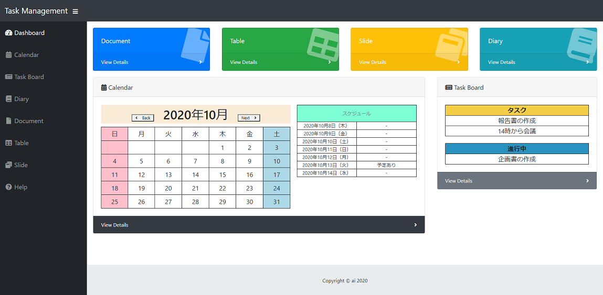
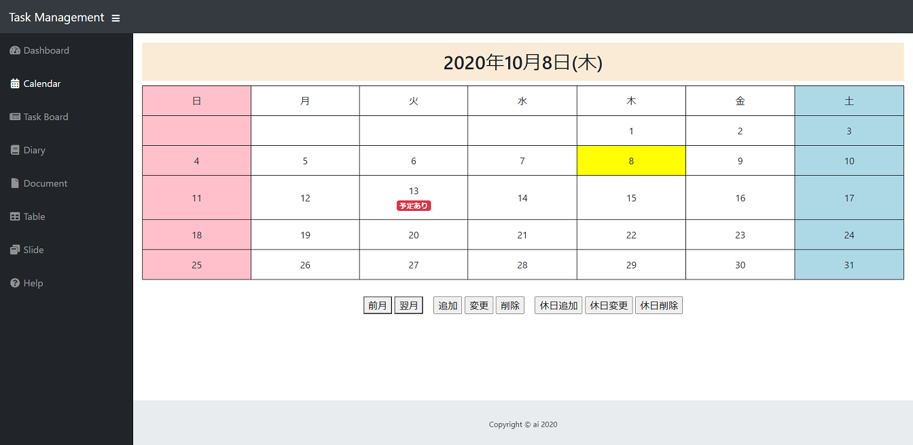
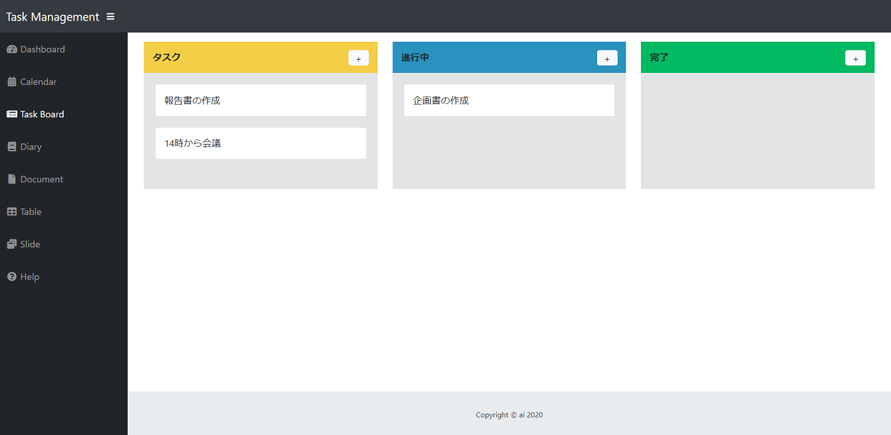
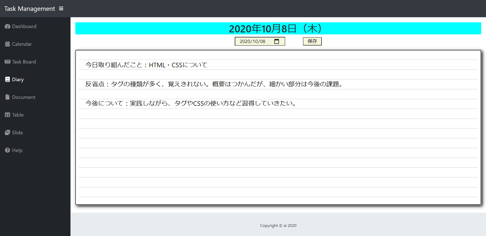
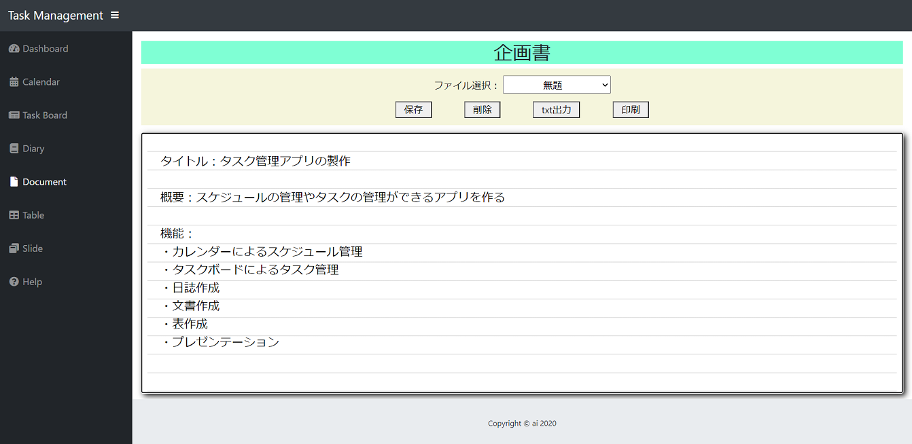
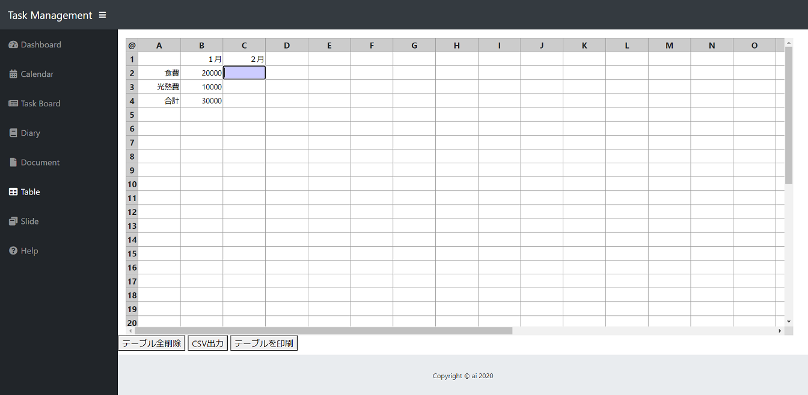
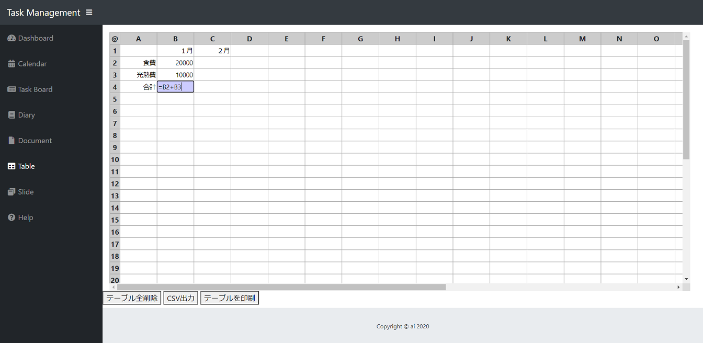
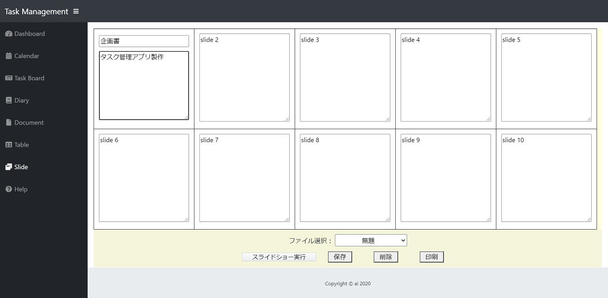
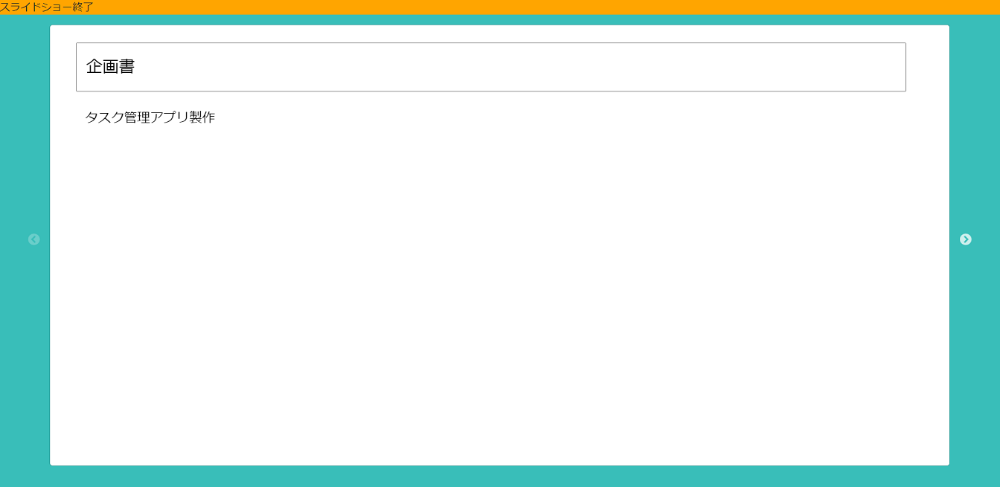

# Task-Management  
Task management app made with Electron.  

# DEMO  
   

# Usage  
Unzip the task-management-electron.zip file and double-click electron-task-management -shortcut.

Or double-click electron-task-management.exe in the electron-task-management-win32-x64 folder.  

## Dashboard
  
Top page of this application.  

Click "View Details" to jump to each page.  

From the left at the top of the screen, the "Document Creation", "Spreadsheet", "Presentation", and "Diary" functions are available.  

At the bottom left of the screen, you can see the calendar and whether or not you have an appointment for the last week entered on the Calendar page.  

At the bottom right of the screen, what you entered on the Task Board page ("Task" and "In Progress") is displayed.  

## Calendar  
  
Schedule management function using a calendar.  

By pressing the "previous month" and "next month" buttons, the month changes.  

Click on the date cell to turn it yellow and, if set, show the schedule for the day at the bottom of the page.  

You can add an appointment by clicking the date and clicking the "Add" button. When an event is added, "Available" is displayed on the calendar.  

You can change the schedule by clicking the schedule and then clicking the "Change" button.  

You can delete an appointment by clicking the appointment and then clicking the "Delete" button.  

You can add a holiday by clicking the date and clicking the "Add Holiday" button. If you add a holiday, that day will turn red, just like Sundays and holidays.  

You can change the holiday settings by clicking the holiday schedule and then pressing "Change Holiday".  

You can delete the holiday settings by clicking the holiday schedule and then pressing "Delete Holiday".  

## Task Board
  
Task management function.   

Divide into "task", "in progress", and "completed" according to the progress.  

Press the "+" button to enter the content, and press the "submit" button to create a task. Press the "cancel" button to cancel.  

You can move tasks by dragging.  

You can delete a task by clicking on it.  

## Diary  
  
Diary function.

Select the date you want to record in the box, enter the text in the text area in the center of the screen, and click the "Save" button to save the description.  

## Document  
  
Document creation function.  

Enter the title and text, and click the "Save" button to save.  

You can open the saved contents by selecting a file from "File selection".  

Select a file from "Select File" and press the "Delete" button to delete the contents.  

If you press the "txt output" button, you can save it as a txt file.  

You can print by pressing the "Print" button.  

If the title is "Untitled", "Save" and "txt output" cannot be performed.  

## Table  
  
Spreadsheet function.  

If you press the "Delete all tables" button, all the contents of the table will be deleted. (There is no partial deletion.)  

If you press the "CSV output" button, you can save it as a CSV file.  

You can print by pressing the "Print Table" button.  

  

As shown in the image above, it is possible to calculate by specifying the cell.  

## Slide  
  
Presentation function.  

Enter the title and slide contents, and click the "Save" button to save.  

You can open the saved contents by selecting a file from "File selection".  

Select a file from "Select File" and press the "Delete" button to delete the contents.  

You can print by pressing the "Print" button.  

If the title is "Untitled", you cannot "Save".  

Click the "Run Slideshow" button to run the slideshow.  

  

Press the arrows on the left and right of the screen to slide.  

To exit, click "End Slideshow" at the top of the screen.  

# Requirements  
- Windows 64bit  

# Author  

* ai  
* [https://tech.airis0.com](https://tech.airis0.com)  

# License   
"Task-Management" is under [Apache License2.0](http://www.apache.org/licenses/LICENSE-2.0.html).   
